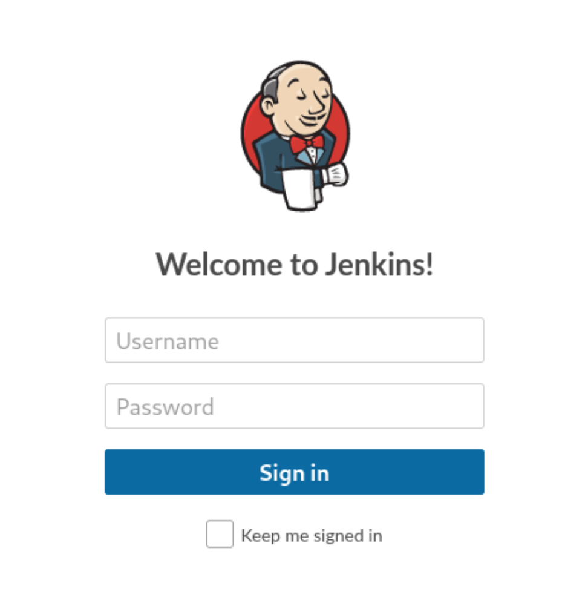

%% Table later %%

# Pennyworth Enumeration

## nmap 

```bash
$ nmap pennyworth.htb 
Starting Nmap 7.94SVN ( https://nmap.org ) at 2024-06-27 23:01 JST
Stats: 0:00:17 elapsed; 0 hosts completed (1 up), 1 undergoing Connect Scan
Connect Scan Timing: About 56.40% done; ETC: 23:02 (0:00:13 remaining)
Stats: 0:00:17 elapsed; 0 hosts completed (1 up), 1 undergoing Connect Scan
Connect Scan Timing: About 60.17% done; ETC: 23:02 (0:00:12 remaining)
Nmap scan report for pennyworth.htb (10.129.231.216)
Host is up (0.20s latency).
Not shown: 999 closed tcp ports (conn-refused)
PORT     STATE SERVICE
8080/tcp open  http-proxy
```


```bash
nmap -sCV pennyworth.htb 
Starting Nmap 7.94SVN ( https://nmap.org ) at 2024-06-27 23:25 JST
Stats: 0:00:02 elapsed; 0 hosts completed (1 up), 1 undergoing Connect Scan
Connect Scan Timing: About 31.62% done; ETC: 23:25 (0:00:06 remaining)
Stats: 0:00:03 elapsed; 0 hosts completed (1 up), 1 undergoing Connect Scan
Connect Scan Timing: About 42.12% done; ETC: 23:25 (0:00:04 remaining)
Nmap scan report for pennyworth.htb (10.129.231.216)
Host is up (0.21s latency).
Not shown: 999 closed tcp ports (conn-refused)
PORT     STATE SERVICE VERSION
8080/tcp open  http    Jetty 9.4.39.v20210325
|_http-title: Site doesn\'t have a title (text/html;charset=utf-8).
|_http-server-header: Jetty(9.4.39.v20210325)
| http-robots.txt: 1 disallowed entry 
|_/

```

Seems like it only has one open HTTP server at `8080`

Key findings: 
- HTTP on port 8080

## Web Access

Accessing `http://pennyworth.htb:8080` ( I added target IP in `/etc/hosts`) led me to a login page for `Jenkins`



Jenkins seems to be an [open-soucred CI/CD](https://www.jenkins.io/) ? I could not find any information on default credential for this product. Given the limited intel, I'm assuming the credential is something basic such as
- `root:password`
- `root:admin`
- `admin:admin`

Turns out `root:password` was the correct combination.


